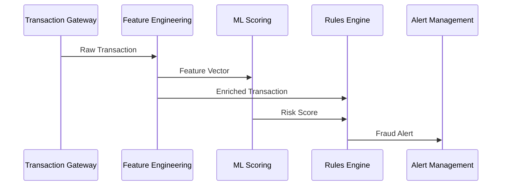
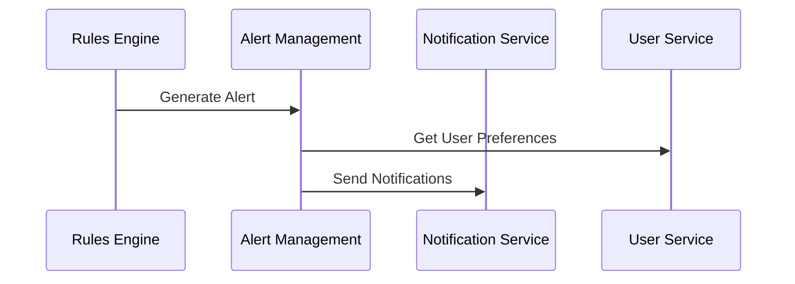

# SentiFraud Microservices Architecture

## Table of Contents
- [Service Overview](#service-overview)
- [Domain Models](#domain-models)
- [Service Communication](#service-communication)
- [Data Flow](#data-flow)
- [Service Details](#service-details)

## Service Overview

### 1. Transaction Gateway Service
- Entry point for all transaction requests
- Handles request validation and initial processing
- Publishes to Kafka for async processing
```yaml
Port: 8080
Dependencies:
  - Kafka
  - Redis
Database: PostgreSQL
```

### 2. Feature Engineering Service
- Processes raw transactions
- Generates features for fraud detection
- Maintains feature history
```yaml
Port: 8081
Dependencies:
  - Kafka
  - Redis
  - MongoDB (Feature Store)
```

### 3. ML Scoring Service
- Executes ML models for fraud detection
- Manages model versions
- Provides risk scores
```yaml
Port: 8082
Dependencies:
  - Redis
  - MongoDB (Model Store)
```

### 4. Rules Engine Service
- Executes Drools rules
- Manages business rules
- Provides rule-based decisions
```yaml
Port: 8083
Dependencies:
  - Kafka
  - Redis
  - PostgreSQL
```

### 5. Alert Management Service
- Handles fraud alerts
- Manages notification preferences
- Sends multi-channel notifications
```yaml
Port: 8084
Dependencies:
  - Kafka
  - Redis
  - MongoDB
```

### 6. Analytics Service
- Processes transaction data for insights
- Generates reports
- Maintains historical data
```yaml
Port: 8085
Dependencies:
  - Kafka
  - Redis
  - PostgreSQL
```

### 7. User Management Service
- Manages user accounts
- Handles authentication/authorization
- Manages user preferences
```yaml
Port: 8086
Dependencies:
  - PostgreSQL
  - Redis
```

### 8. Merchant Service
- Manages merchant profiles
- Handles merchant-specific rules
- Tracks merchant performance
```yaml
Port: 8087
Dependencies:
  - PostgreSQL
  - Redis
```

## Domain Models

### Transaction Domain
```java
@Entity
public class Transaction {
    @Id
    private String id;
    private String userId;
    private String merchantId;
    private BigDecimal amount;
    private String currency;
    private LocalDateTime timestamp;
    private TransactionType type;
    private TransactionStatus status;
    private DeviceInfo deviceInfo;
    private GeoLocation location;
    private Map<String, String> metadata;
}

@Entity
public class TransactionRisk {
    @Id
    private String id;
    @OneToOne
    private Transaction transaction;
    private Double riskScore;
    private List<RiskFactor> riskFactors;
    private RiskLevel riskLevel;
    private LocalDateTime evaluationTime;
}
```

### Feature Domain
```java
@Document
public class FeatureVector {
    @Id
    private String id;
    private String transactionId;
    private Map<String, Double> numericalFeatures;
    private Map<String, String> categoricalFeatures;
    private LocalDateTime createdAt;
}

@Document
public class FeatureDefinition {
    @Id
    private String id;
    private String name;
    private FeatureType type;
    private String description;
    private String formula;
    private Boolean isActive;
}
```

### Alert Domain
```java
@Entity
public class Alert {
    @Id
    private String id;
    @ManyToOne
    private Transaction transaction;
    private AlertType type;
    private AlertSeverity severity;
    private AlertStatus status;
    private LocalDateTime createdAt;
    private List<NotificationStatus> notifications;
}

@Entity
public class NotificationPreference {
    @Id
    private String id;
    private String userId;
    private NotificationType type;
    private Boolean enabled;
    private TimeWindow quietHours;
}
```

### User Domain
```java
@Entity
public class User {
    @Id
    private String id;
    private String email;
    private UserType type;
    private UserStatus status;
    @OneToMany
    private List<NotificationPreference> notificationPreferences;
    private LocalDateTime createdAt;
}

@Entity
public class Merchant {
    @Id
    private String id;
    private String name;
    private MerchantCategory category;
    private MerchantStatus status;
    private RiskLevel riskLevel;
    @OneToMany
    private List<MerchantRule> customRules;
}
```

## Service Communication

### Kafka Topics
```yaml
Topics:
  raw-transactions:
    partitions: 10
    replication-factor: 3
    retention: 7d
  
  enriched-transactions:
    partitions: 10
    replication-factor: 3
    retention: 7d
    
  fraud-alerts:
    partitions: 5
    replication-factor: 3
    retention: 30d
    
  transaction-analytics:
    partitions: 10
    replication-factor: 3
    retention: 90d
```

### Event Models
```java
public class TransactionEvent {
    private String eventId;
    private EventType type;
    private Transaction transaction;
    private LocalDateTime timestamp;
    private Map<String, String> metadata;
}

public class AlertEvent {
    private String eventId;
    private EventType type;
    private Alert alert;
    private LocalDateTime timestamp;
    private List<String> recipients;
}
```

## Data Flow

1. Transaction Flow


2. Alert Flow


## Service Details

### Transaction Gateway Service
```yaml
Endpoints:
  POST /api/v1/transactions:
    - Validates transaction request
    - Performs initial risk check
    - Publishes to Kafka
  
  GET /api/v1/transactions/{id}:
    - Retrieves transaction status
    - Includes risk assessment
```

### Feature Engineering Service
```yaml
Features:
  Velocity:
    - Transaction count per timeframe
    - Amount velocity
    - Geographic velocity
  
  Pattern:
    - Time pattern deviation
    - Amount pattern deviation
    - Merchant pattern deviation
  
  Risk:
    - Geographic risk
    - Device risk
    - Amount risk
```

### ML Scoring Service
```yaml
Models:
  Transaction Risk:
    - Random Forest
    - Neural Network
    - Gradient Boosting
  
  Pattern Detection:
    - Isolation Forest
    - DBSCAN
    - Autoencoder
```

### Rules Engine Service
```yaml
Rule Categories:
  Amount Rules:
    - Threshold checks
    - Currency specific rules
    
  Velocity Rules:
    - Transaction frequency
    - Amount velocity
    
  Pattern Rules:
    - Time patterns
    - Location patterns
    
  Custom Rules:
    - Merchant specific
    - User specific
```

## Deployment

Each service is containerized and deployed using Docker. Example docker-compose:

```yaml
version: '3.8'

services:
  transaction-gateway:
    build: ./transaction-gateway
    ports:
      - "8080:8080"
    environment:
      - SPRING_PROFILES_ACTIVE=prod
      
  feature-engineering:
    build: ./feature-engineering
    ports:
      - "8081:8081"
    environment:
      - SPRING_PROFILES_ACTIVE=prod
      
  ml-scoring:
    build: ./ml-scoring
    ports:
      - "8082:8082"
    environment:
      - SPRING_PROFILES_ACTIVE=prod
      
  # Additional services...
```

## Monitoring

Each service exports metrics for:
- Request latency
- Error rates
- Transaction volume
- Processing time
- Queue length
- Resource usage

Metrics are collected by Prometheus and visualized in Grafana dashboards.

---
